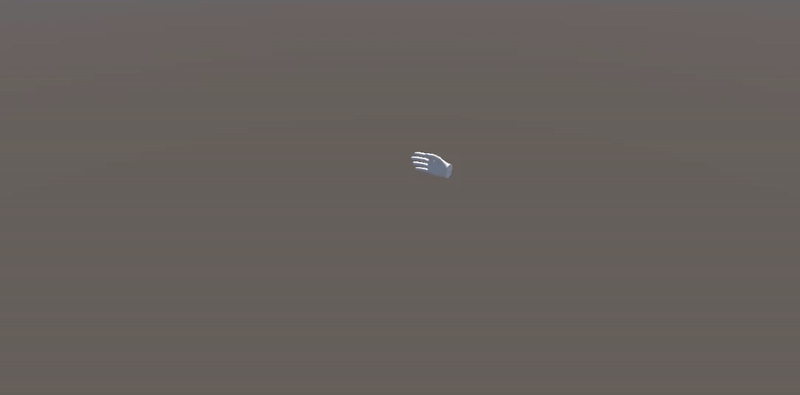

# [2024-12-30] LSTM을 이용한 UNITY 손 추적

---

LSTM으로 손 움직임을 학습해 보았다.

사실 LSTM이 아니라 GRU를 쓰고 싶었다. 근데 막상 학습시키고 난 후 onnx로 모델을 추출하니 unity에서는 gru를 지원하지 않는다는 청천벽력같은 소리를 듣고 말았다.

눈물을 머금고 재학습시킬수밖에 없었다...

모델은 다음과 같이 설계했다.

~~~python
import torch
import torch.nn as nn
import math

class GEGLU(nn.Module):
    def __init__(self):
        super(GEGLU, self).__init__()
        self.gelu = nn.GELU()
    
    def forward(self, x):
        return x * self.gelu(x)

class LSTMModel(nn.Module):
    def __init__(self, input_size, hidden_layer_size, output_size, time_step):
        super(LSTMModel, self).__init__()

        self.hidden_layer_size = hidden_layer_size
        self.output_size = output_size

        self.lstm = nn.LSTM(input_size, hidden_layer_size, dropout=0.1,
                          num_layers=2, batch_first=True, bidirectional=True)
        
        self.layer_norm_1 = nn.LayerNorm(input_size)
        self.layer_norm_2 = nn.LayerNorm(hidden_layer_size * 2)
        self.attention_1 = nn.MultiheadAttention(embed_dim=input_size, num_heads=8, dropout=0.1)
        self.attention_2 = nn.MultiheadAttention(embed_dim=hidden_layer_size * 2, num_heads=8, dropout=0.1)

        self.fc_1 = nn.Sequential(
            nn.Linear(hidden_layer_size * 2, hidden_layer_size * 4),
            GEGLU(),
            nn.Linear(hidden_layer_size * 4, hidden_layer_size * 2)
        )

        self.fc_2 = nn.Sequential(
            nn.Linear(hidden_layer_size * 2, hidden_layer_size),
            GEGLU(),
            nn.Dropout(),
            nn.Linear(hidden_layer_size, 1),
        )

        self.output = nn.Linear(time_step, output_size)

    def forward(self, x):
        x = x + self.positional_encoding(x)
        
        x = x.transpose(0, 1)
        attn_output, _ = self.attention_1(x, x, x)
        x = self.layer_norm_1(x + attn_output)
        x = x.transpose(0, 1)

        x, _ = self.lstm(x)

        x = x.transpose(0, 1)
        attn_output, _ = self.attention_2(x, x, x)
        x = self.layer_norm_2(x + attn_output)
        x = x.transpose(0, 1)

        x = self.fc_1(x)
        x = self.fc_2(x).squeeze()
        x = self.output(x)

        return x
    
    def positional_encoding(self, x):
        position = torch.arange(0, x.size(1)).unsqueeze(1).float().to(x)
        div_term = torch.exp(torch.arange(0, x.size(2), 2).float() * -(math.log(10000.0) / x.size(2))).to(x)
        pe = torch.zeros(x.size(1), x.size(2)).to(x)
        pe[:, 0::2] = torch.sin(position * div_term)
        pe[:, 1::2] = torch.cos(position * div_term)
        pe = pe.unsqueeze(0).repeat(x.size(0), 1, 1)
        return pe
~~~

요즘 핫하다는 Swigru와 Gegru를 적용해 보았고, 위치 인코딩과 어텐션을 추가했다.

LSTM에 위치 인코딩이 필요한가 싶지만, 어텐션을 적용한 이상 추가하는게 맞지 않을까 싶다.

사실 트렌스포머 구조를 만들고 싶었는데, LSTM을 사용하라고 하니 어쩔수 있나...

그래도 나름 좋은 성능이었다.

총 30개의 입력을 받고 10개의 출력을 내뱉도록 훈련했으며, 최종적으로 값을 예측할 때는 지수의 역함수의 가중치를 더해서 보정했다.

꽤 그럴듯한 예측이지 않은가?

이것 말고도 전에 작성했던 나만의 loss 함수를 적용해 보기도 하고, 하여간 재밌는 경험이었다.

반투명이 다음 예측 위치다. 나름 잘 되는 것 같기도?
