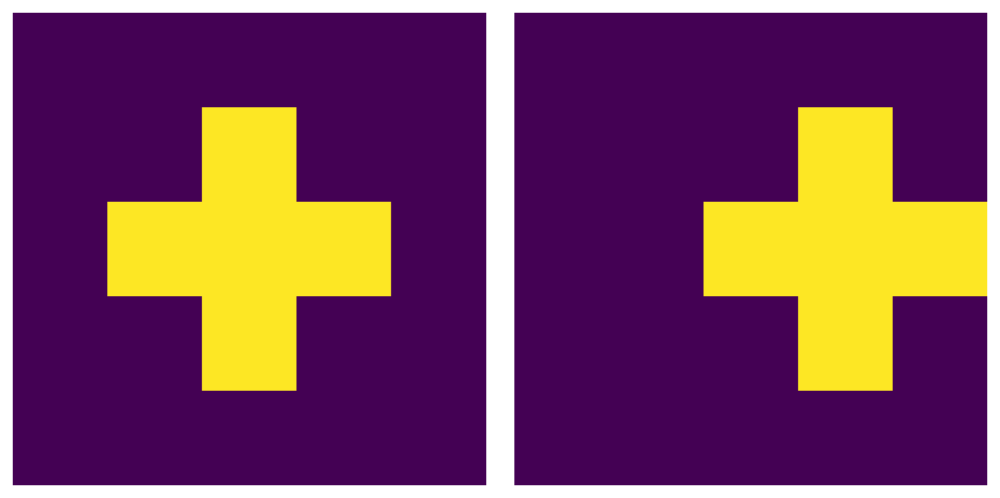

# [2025-06-07] Conv 규제를 구상해 보자

---

최근에 정보 이론을 접할 일이 많았고, 또 딥러닝을 배우고 있다.

이제와서 딥러닝을 배우냐? 라고 말할 수 있지만 딥러닝을 예전에도 배우긴 배웠다. 근데 이번에는 "딥러닝" 과목을 수강했다는 거지.

아무튼, 멍하게 강의를 듣다가 Conv 파트가 나왔는데 필터 모양을 보니까 문득 생각이 든 거다.

> 저렇게 비슷한 필터가 많으면 비효율적이지 않나?

아니 필터를 이미지화한 게 너무나 비슷한게 많은데 저래도 되는건가? 싶다. 정보 이론에서 그 뭐냐 희소 코딩이란게 괜히 있겠는가? 나는 이 희소 코딩 방식을 커널에 적용해야 하는게 아닌가 생각했다. 그래서 좀 찾아보니 나랑 비슷한 생각을 한 사람이 있긴 있었다.

찾아보니 필터 간 직교성을 규제로 추가해서, 공분산이 어쩌고 하는 논문을 몇개 찾긴 했는데 아무리 생각해도 만족할 만한 내용일리가 없었다. 생각해봐. 같은 모양의 필터인데 좌우로 조금씩만 움직였다고 다른 필터 취급되는게 좋을 리가 없잖아.

<em>아무리 생각해도 이건 같은 필터 아닌가?</em>

단순히 위상이 변화했다고 다른 필터 취급하면 뭔가 뭔가다. 그래서 생각해냈다. 새로운 규제를!

일단 필터를 하나의 주파수 증폭기라고 가정했다. 이미지의 주파수를 필터를 통과시켜서 증폭하거나 약화시키는 개념이다. 그럼 이걸 일종의 파동이라 해석할 수 있고, 결국에는 필터를 FFT로 분해할 수 있다!

FFT로 분해하면 뭐가 좋냐면, 위상을 무시하고 파동의 조합만으로 표현할 수 있다는 거다. 위상 차이는 사라지고, 오로지 형태의 유사성만 남게 되니 내가 생각했지만 완벽하지 않은가?

그럼 이제 FFT로 구한 파동의 차이를 계산해야 하는데... 나는 이걸 일종의 확률 분포로 보고 KL Divergence로 계산해보기로 했다. KL로 계산하면 두 파동의 분포가 얼마나 유사한지를 알 수 있을테니 얼마나 좋은가.

MSE로 계산할 수도 있겠는데... FFT를 MSE로 비교하는건 뭔가 아닌거 같기도 하고... 뭣보다 MSE는 진폭도 영향을 받지 않나?

그럼 이제 뭔가를 생각해 봤으니 증명을 해봐야 하겠지. 나는 ResNet에 규제를 추가해서 검증하려고 했다.

했었는데...

> 너무 느리다...

아니 밥먹고 왔는데 1 epoch도 안돌아가있으면 어쩌라는 건지. FFT가 비싸긴 비싼가 보다. 결국 검증은 하지 못했고, 상상 속의 기법으로만 남게 되었다.

나 억울해. 모처럼 좋은 아이디어였는데

