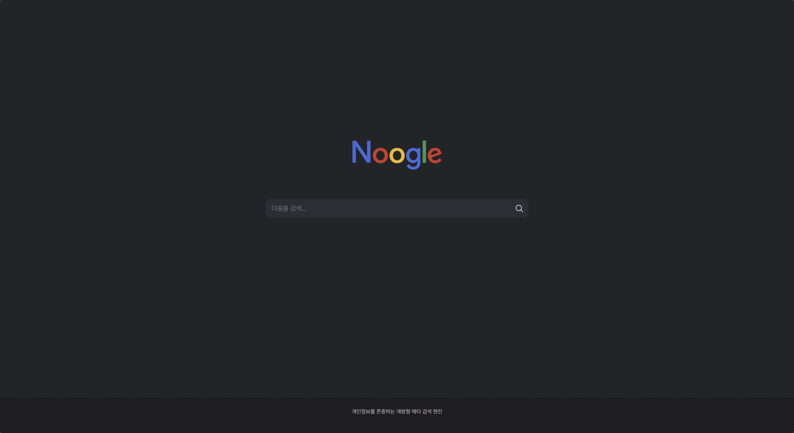

# [2025-08-15] 검색 엔진을 운영해 보자.

---

사이버 망령으로서 그동안 구글에 정보를 퍼주고 있었다. 하지만 마땅한 대체제도 없고, 검색 품질과 개인정보를 저울질하자니 머리가 아파왔다. 좀 찾아보니 DuckDuckGo 같은 검색 엔진이 있긴 했는데, 이게 MS에 정보를 팔았다는 소리도 있고... 기본적으로 Zero-Trust 마인드를 탑제한 나로서는 괴로운 일이다.

그래서 좀 더 찾아보니 SearXNG라는게 있었다. 이건 각 검색 엔진의 결과를 종합해서 보여주는 건데, 웬 Perplexity가 있어서 좀 알아봤더니 내부적으로 이걸 사용해서 검색을 하고 있다고 한다. 거 잘 쓰고 있긴 한데, 뜬금없는 데서 나오니 좀 당황스럽긴 하네.

하긴 검색 플랫폼을 사용하는 요금도 있긴 할테니 오픈소스-무료로 가능한 이것도 나름 합리적인 선택이라 할 수 있겠다. 아무튼 돌아와서 이게 메인이 아니라, 나는 이걸 써보고 싶다는 욕구가 샘솟았다.

나만의 검색엔진... 이걸 어떻게 참겠는가. 바로 설치해 봤다.

요즘은 죄다 도커로 나와서 설치가 아주 편했다. 도커 딸깍이 이럴땐 너무 감사하다. 아무튼 도커를 이용해서 큰맘먹고 호스팅까지 해가면서 설치한 결과, 좀 색다른 인터넷 환경이 되었다. 겸사겸사 새로 테마도 만들어 보고, 내 환경에 최적화도 해보면서 좀 써보니 확실히 뭔가 뭔가다.

<a href="../images/screenshot-1755209691099.png" style="display:inline-block;">
  
</a>

만든 검색 사이트다. No-Google이라는 뜻에서 Noogle이다. 핫핫핫하.

최대한 구글과 비슷하게 환경을 맞춰줬고, 검색해보니 구글 검색에서 나오지 않는 것도 검색이 된다. 이게 다양성이고 이게 PC지. 암

좀 더 찾아보니 Tor 관련 확장이 있기는 한데... 솔직히 Tor 쓸일이 뭐가 있겠는가. 그냥 무시했다.

사실 설치하는 것보다 테마 꾸미는 게 더 오래걸렸다. 이것저것 이미지 가져오고, html, css 가져오고 난리도 아녔다. 그래도 뭐, 만들고 나니 좀 볼만하다.

그리고 검색 엔진 특성상, 분명 트레픽이 어마어마하게 먹힐 것이 분명했다. 그래서 원래는 대충 한국에 있는 무료 클라우드 인스턴스에 띄워서 사용했겠지만, 좀 더 트레픽에 관대한 업체에 호스팅했다. 문제는 그게 유럽 업체라는 거고, 그래서 좀 많이 느리긴 한데, 어쩔수 있나. 한달에 6000원이면 사실상 공짜나 다름없으니 감사하며 쓰자.

Hetzner Cloud라는 업체인데, 6000원에 한달 무료 트레픽이 무려 20TB고 2코어 4gb니 가성비 하나는 끝장난다. 솔직히 내가 유럽 사람이었으면 자주 애용했을 것 같은데, 왜 국내에는 이런 업체가 없는거야...

혹시 나와 같은 길을 걸으려 하는 자를 위해 간단한 compose 파일을 공유한다. 캐시 컨테이너 + 리버스 프록시 컨테이너 + SearXNG 2개 + 컨테이너 업데이트용 컨테이너 1개 해서 문제 없이 돌아간다.

---
### docekr-compose.yml
---

```yaml

version: "3.9"

services:
  searxng-1:
    image: searxng/searxng:latest
    container_name: searxng-1
    restart: unless-stopped
    environment:
      INSTANCE_NAME: ${INSTANCE_NAME}
      BIND_ADDRESS: 0.0.0.0:8080
      SEARXNG_SECRET: ${SEARX_SECRET}
      TMPDIR: /tmp
      BASE_URL: "https://${DOMAIN}"
    volumes:
      - ./settings.yml:/etc/searxng/settings.yml:ro
    read_only: true
    cap_drop: [ "ALL" ]
    tmpfs:
      - /tmp:rw,noexec,nosuid,nodev
      - /var/tmp:rw,noexec,nosuid,nodev
    healthcheck:
      test: ["CMD", "python3", "-c", "import urllib.request,sys;sys.exit(0 if urllib.request.urlopen('http://127.0.0.1:8080/').getcode()==200 else 1)"]
      interval: 15s
      timeout: 3s
      retries: 10
      start_period: 30s
    networks: [ searxnet ]
    depends_on:
      redis:
        condition: service_healthy
    deploy:
      resources:
        limits:
          memory: ${SEARX_MEMORY}
          cpus: "${SEARX_CPUS}"
    labels:
      - "com.centurylinklabs.watchtower.enable=true"

  searxng-2:
    image: searxng/searxng:latest
    container_name: searxng-2
    restart: unless-stopped
    environment:
      INSTANCE_NAME: ${INSTANCE_NAME}
      BIND_ADDRESS: 0.0.0.0:8080
      SEARXNG_SECRET: ${SEARX_SECRET}
      TMPDIR: /tmp
      BASE_URL: "https://${DOMAIN}"
    volumes:
      - ./settings.yml:/etc/searxng/settings.yml:ro
    read_only: true
    cap_drop: [ "ALL" ]
    tmpfs:
      - /tmp:rw,noexec,nosuid,nodev
      - /var/tmp:rw,noexec,nosuid,nodev
    healthcheck:
      test: ["CMD", "python3", "-c", "import urllib.request,sys;sys.exit(0 if urllib.request.urlopen('http://127.0.0.1:8080/').getcode()==200 else 1)"]
      interval: 15s
      timeout: 3s
      retries: 10
      start_period: 30s
    networks: [ searxnet ]
    depends_on:
      redis:
        condition: service_healthy
    deploy:
      resources:
        limits:
          memory: ${SEARX_MEMORY}
          cpus: "${SEARX_CPUS}"
    labels:
      - "com.centurylinklabs.watchtower.enable=true"

  redis:
    image: redis:7-alpine
    container_name: searxng-redis
    command: ["redis-server", "--save", "", "--appendonly", "no"]
    restart: unless-stopped
    healthcheck:
      test: ["CMD", "redis-cli", "ping"]
      interval: 10s
      timeout: 3s
      retries: 10
    deploy:
      resources:
        limits:
          memory: ${REDIS_MEMORY}
          cpus: "${REDIS_CPUS}"
    networks: [ searxnet ]

  caddy:
    image: caddy:2-alpine
    container_name: searxng-caddy
    restart: unless-stopped
    ports:
      - "${HTTP_PORT}:80"
      - "${HTTPS_PORT}:443"
    environment:
      DOMAIN: ${DOMAIN}
      ACME_EMAIL: ${ACME_EMAIL}
    volumes:
      - ./Caddyfile:/etc/caddy/Caddyfile:ro
      - caddy_data:/data
      - caddy_config:/config
    deploy:
      resources:
        limits:
          memory: ${CADDY_MEMORY}
          cpus: "${CADDY_CPUS}"
    networks: [ searxnet ]

  watchtower:
    image: containrrr/watchtower
    container_name: watchtower
    restart: unless-stopped
    volumes:
      - /var/run/docker.sock:/var/run/docker.sock
    environment:
      WATCHTOWER_CLEANUP: "true"
      WATCHTOWER_POLL_INTERVAL: 86400
      WATCHTOWER_INCLUDE_STOPPED: "true"
      WATCHTOWER_LABEL_ENABLE: "true"
      WATCHTOWER_ROLLING_RESTART: "true"

networks:
  searxnet:

volumes:
  caddy_data:
  caddy_config:


```

이걸 사용하려면 setting 파일 + Caddy file이 필요하다.

---
### settings.yml
---

```yaml
use_default_settings: true

server:
  secret_key: "${SEARX_SECRET}"
  bind_address: "${SEARX_BIND}"
  limiter: false
  image_proxy: true
  public_instance: false 
  trusted_proxies:
    - 172.16.0.0/12

ui:
  static_use_hash: true 

general:
  instance_name: "Noogle"

valkey:
  url: redis://searxng-redis:6379/0

```

---
### Caddyfile
---

```

{
  servers {
    protocols h1 h2 h3
  }
  email {$ACME_EMAIL}
}

{$DOMAIN} {
  encode zstd gzip

  header {
    X-Frame-Options "DENY"
    Referrer-Policy "no-referrer"
    Permissions-Policy "geolocation=()"
    X-Content-Type-Options "nosniff"
    Strict-Transport-Security "max-age=31536000; includeSubDomains; preload"
  }

  reverse_proxy searxng-1:8080 searxng-2:8080 {
    lb_policy least_conn
    health_uri /
    health_interval 10s
    health_timeout 2s
    fail_duration 30s

    header_up Host {host}
    header_up X-Real-IP {remote_host}
    header_up X-Forwarded-For {remote_host}
    header_up X-Forwarded-Proto {scheme}
  }
}

```

필요한 변수는 .env 파일로 넣으면 된다. 이럼 알아서 잘 돌아간다.

써볼 사람은 써보자. 나는 지금 주력으로 써 보고 있다(오늘 기준).

[> Go](https://search.onetwohour.com){: .btn}