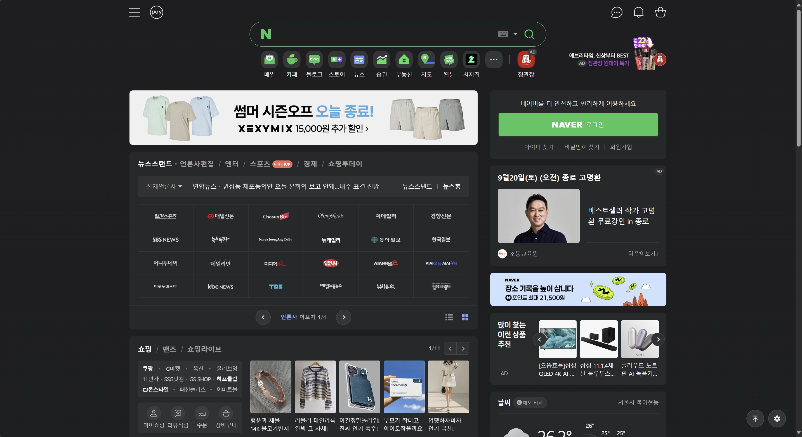

# [2025-09-01] 네이버를 구글처럼

---

솔직히 네이버 UI 많이 구리다.

익숙해서 적응하긴 했지만 검색엔진 치고 너무 복잡하고 요소가 많다.

<a href="../images/naver.jpeg" style="display:inline-block;">
  
</a>

근데 또 구글처럼 하자니 네이버에서 제공하는 여러가지 서비스를 보기에는 많이 불편하단 말이지...

옛날에는 구글처럼 검색창만 보이게 네이버에서 자체적으로 제공하는 se.naver.com이 있었는데 지금 찾아보니 서비스 종료했다고 한다.

그래서 만들었다. *Minaver*

최소화된 네이버라는 뜻에서 Minaver다. 

주요 특징으로는 일단 시작 화면을 구글처럼 바꿨다. 중앙에 딱 검색창 하나만 덜렁 있도록 수정했다.

그럼 메일이나 뉴스같은건 어떻게 보냐 할 수 있는데, 스크롤을 하면 나머지 화면이 펼쳐지면서 볼 수 있다. 이정도면 훌륭한 절충안 같다.

사실 스크롤이 아니라 버튼으로 조작하게 하려고 했는데...

UI 정렬 문제도 있고, 미니멈을 추구하는데 뭔가를 더 추가한다는게 영 거시기해서 그냥 스크롤로 합의 봤다.

<a href="../images/minaver.webp" style="display:inline-block;">
  
</a>

전환 속도도 옵션으로 수정할 수 있고, 0으로 설정하면 아예 애니메이션을 끌수도 있다.

훨씬 화면이 깔끔하고 나머지 요소도 접근할 수 있으니 좋은 대안 같긴 하다.

요소에 접근하려면 깊이가 하나 더 증가해서 마음에 걸리긴 하지만...

못생긴 것보단 낫겠지 ㅎㅎ;;

유저스크립트고, 설치해서 쓰면 된다. 근데 이상하게 Tampermonkey로는 작동이 안된다. 파이어폭스에서는 잘되던데... 아마 브라우저 정책 때문일수도. 

Violentmonkey로는 잘 작동하니 Violentmonkey를 쓰든, 아니면 애드가드를 쓰든 하자. 

코드는 다음과 같다.

```js
(function() {
    'use strict';
 
    let animationDuration = GM_getValue('animationDuration', 0.7);
 
    GM_registerMenuCommand('애니메이션 속도 설정', () => {
        const currentSpeed = GM_getValue('animationDuration', 0.7);
        const newSpeedInput = prompt('애니메이션 속도를 초 단위로 입력하세요 (예: 0.5):', currentSpeed);
 
        if (newSpeedInput === null) {
            return;
        }
 
        const newSpeed = parseFloat(newSpeedInput);
 
        if (!isNaN(newSpeed) && newSpeed >= 0) {
            GM_setValue('animationDuration', newSpeed);
            alert(`애니메이션 속도가 ${newSpeed}초로 저장되었습니다. 페이지를 새로고침하면 적용됩니다.`);
        } else {
            alert('유효한 숫자를 입력하세요.');
        }
    });
 
    GM_addStyle(`
        #header {
            position: relative;
        }
        #topSearchWrap {
            position: absolute;
        }
        body:not(.ui-expanded) #topSearchWrap {
            top: 50%;
            transform: translateY(-50%);
        }
        body:not(.ui-expanded) {
            overflow: hidden;
        }
        body:not(.ui-expanded) #header {
            height: 100vh;
        }
        #wrap > *:not(#header),
        #header > *:not(#topSearchWrap),
        #topSearchWrap > *:not(#search_area) {
            transition: opacity ${animationDuration}s ease-in-out;
        }
        body:not(.ui-expanded) #wrap > *:not(#header),
        body:not(.ui-expanded) #header > *:not(#topSearchWrap),
        body:not(.ui-expanded) #topSearchWrap > *:not(#search_area) {
            opacity: 0;
            transition: opacity 0s;
            pointer-events: none;
        }
    `);
 
    document.addEventListener('DOMContentLoaded', () => {
        const header = document.getElementById('header');
        const searchWrap = document.getElementById('topSearchWrap');
        if (!header || !searchWrap) return;
 
        const expandUI = () => {
            animationDuration = GM_getValue('animationDuration', 0.7);
            const initialClientWidth = document.documentElement.clientWidth;
 
            document.body.classList.add('ui-expanded');
 
            const scrollbarWidth = initialClientWidth - document.documentElement.clientWidth;
            const horizontalShift = scrollbarWidth / 2;
 
            header.style.transition = 'none';
            searchWrap.style.transition = 'none';
            header.style.height = 'auto';
            const finalHeaderHeight = header.offsetHeight;
            const finalSearchWrapTop = searchWrap.offsetTop;
 
            header.style.height = '100vh';
            searchWrap.style.top = '50%';
            searchWrap.style.transform = `translate(${horizontalShift}px, -50%)`;
 
            void header.offsetHeight;
 
            header.style.transition = `height ${animationDuration}s ease-in-out`;
            searchWrap.style.transition = `top ${animationDuration}s ease-in-out, transform ${animationDuration}s ease-in-out`;
            header.style.height = finalHeaderHeight + 'px';
            searchWrap.style.top = finalSearchWrapTop + 'px';
            searchWrap.style.transform = 'none';
 
            setTimeout(() => document.getElementById('query').focus(), 100);
        };
 
        window.addEventListener('wheel', expandUI, { once: true });
        setTimeout(() => document.getElementById('query').focus(), 100);
    });
})();
```

[깃허브](https://github.com/onetwohour/Minaver){: .btn .btn-success}
[Greasy Fork](https://greasyfork.org/ko/scripts/547954-minaver){: .btn .btn-success}

