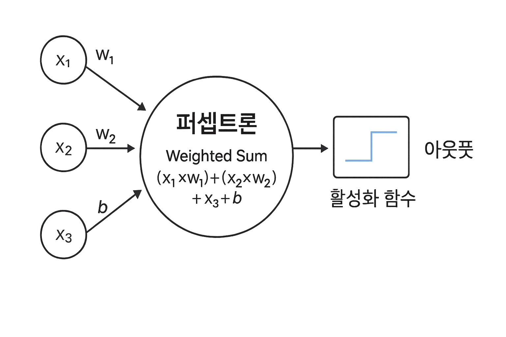
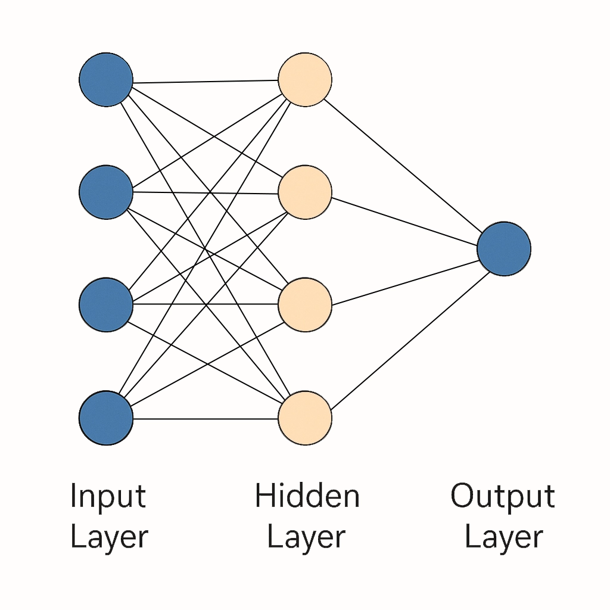
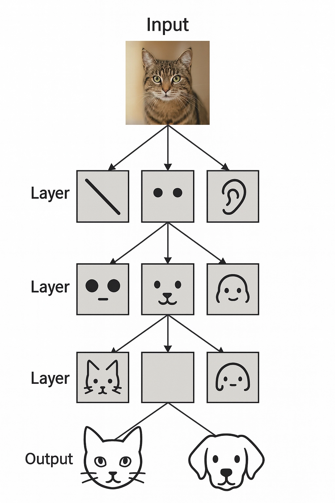
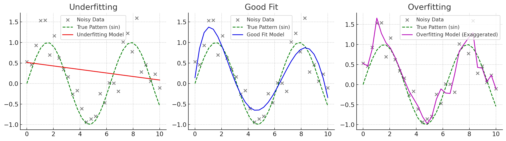

# [2025-10-03] 쉽게 이해하는 딥러닝 기초

---

분명 나는 일주일에 하나씩 올리겠다 했는데...

뭐 그렇게 됐다. 변명을 하자면, 쓸만한 주제가 없는데 어떡해... 얄팍한 지식으로 그럴싸하게 포장하는 글을 쓰고 싶지는 않았다. 그냥 '요즘 이게 유행이래!' 하고 끝낼 거면 시작도 안 했다.

그래서 차라리 시리즈물로 갈까 생각중이다. 분량상 한 문서로 끝나지 않는것도 있고, 한번에 전부 설명하는 것도 힘들고... 그냥 시리즈로 작성하는게 좀 더 낫지 않나 싶다.

아무튼 그래서 오늘은 딥러닝을 알아보는 시간이다.

### 1. 퍼셉트론 (Perceptron)

---

사실 역사를 설명하는 게 지루하고 현학적이긴 한데, 또 딥러닝을 설명하려면 역사대로 가는 게 제일 쉽다. 세상 이치가 그래. 그럼 그 시작이 뭐냐 하면 바로 **퍼셉트론**이다.

퍼셉트론은 1957년, 프랑크 로젠블랫이라는 사람이 제안한 알고리즘이다. 거창하게 들리지만, 쉽게 말해 그냥 **함수**다. 인풋(입력)을 여러 개 넣으면, 안에서 뭔가를 이리저리 계산해서 아웃풋(출력)을 딱 뱉어주는. 마치 자판기에 동전 여러 개 넣고 버튼 누르면 음료수 하나가 툭 튀어나오는 것과 같다.

다만 이 함수는 특징이 있다. 내부적으로 **가중합(Weighted Sum)** 이라는 걸 한다는 점이다. 이게 무슨 소리냐.

입력값들이 들어오면, 각각의 입력값에 '중요도'를 의미하는 **가중치(Weight)** 를 곱해준다. 예를 들어 '오늘 외출할까?'를 결정하는 퍼셉트론이 있다고 치자. 입력값으로 '날씨', '기분', '약속 유무'가 들어온다. 약속이 있다면 다른 요소는 볼 것도 없이 외출해야 하니 '약속 유무'의 가중치는 아주 높을 것이다. 반면 '기분'은 좀 덜 중요하니 가중치가 낮을 수 있다.

이렇게 각각의 입력값($x_1, x_2, ...$)에 각각의 가중치($w_1, w_2, ...$)를 곱해서 전부 더한다. 이게 가중합이다.
$$\text{Weighted Sum} = (x_1 \times w_1) + (x_2 \times w_2) + \dots + (x_n \times w_n)$$
그리고 여기에 추가로 **편향(Bias)** 이라는 녀석을 더해준다. 편향은 일종의 '기본 점수'나 '기본 성향'이라고 생각하면 편하다. 가중합 결과가 얼마나 활성화될지를 조절하는 기준점이다. 예를 들어, 나는 기본적으로 외출을 좋아하는 '인싸'라면 편향 값이 양수(+)일 것이고, 아싸라면 음수(-)일 것이다.

이렇게 계산된 최종 값을 **활성화 함수(Activation Function)** 라는 곳에 한번 더 통과시킨다. 초기 퍼셉트론에서는 이 활성화 함수가 아주 단순했는데, 바로 **계단 함수(Step Function)** 였다. 계산된 값이 특정 임계값(예: 0)을 넘으면 1을 출력하고, 넘지 못하면 0(또는 -1)을 출력한다. '외출한다(1)' 또는 '안 한다(0)' 처럼, 이분법적인 결정을 내리는 스위치 역할을 하는 셈이다.

그럼 그 중요한 가중치랑 편향은 어떻게 알까? 사람이 일일이 설정하나?

그러면 인공-지능이 아니라 바이오-지능이다... 바로 이 지점에서 '학습'이라는 개념이 등장한다.

농담이 아니라, 처음에는 정말로 그랬다. 그냥 데이터를 넣어서 결과를 잘 설명할 수 있는 값으로 가중치를 사람이 어림짐작으로 업데이트했다. 하지만 곧 깨닫게 된다. 이걸 자동으로 하게 만들어야 내가 골병들어 죽지 않겠다고.

그래서 나온 방법론이 이거다.
1.  일단 가중치를 랜덤한 값으로 초기화한다.
2.  데이터를 넣고 퍼셉트론으로 계산을 해본다. (예측값)
3.  결과가 실제 정답과 다르면, 오류가 발생한 것이다.
4.  이 오류를 줄이는 방향으로 가중치를 '아주 조금씩' 조절한다.
5.  모든 데이터에 대해 이 과정을 수없이 반복한다.

여기서 '오류를 줄이는 방향으로 조절한다'는 아이디어가 바로 **경사 하강법(Gradient Descent)** 의 원시적인 형태다. 지금 당장 경사 하강법을 완벽히 이해할 필요는 없다. 그냥 "정답에 가까워지기 위해 어느 방향으로 가중치를 바꿔야 할지 계산해서, 그 방향으로 조금씩 수정해나가는 과정" 정도로만 기억해두자. 산 정상에서 안개를 뚫고 가장 낮은 계곡으로 내려가기 위해, 발밑의 경사가 가장 가파른 방향으로 한 걸음씩 내딛는 모습을 상상하면 된다.

이렇게 퍼셉트론이라는 개념이 나왔고, 심지어 스스로 학습하는 방법까지 고안됐다. 사람들은 당연히 좋아라 했다. 인간의 뇌를 구성하는 뉴런의 동작 방식을 모방한 이 모델이 언젠가 인간처럼 생각하게 될 것이라고 믿었다. 인공지능의 시대가 열리는 듯했다.

그러다가 1969년, 마빈 민스키와 시모어 페퍼트가 『퍼셉트론』이라는 책을 출간하며 이 장밋빛 미래에 제대로 찬물을 끼얹는다. 그들은 퍼셉트론이 무엇을 할 수 있는지가 아니라, **무엇을 할 수 없는지**를 수학적으로 증명해버렸다.

**퍼셉트론은 선형(Linear) 문제밖에 풀지 못한다.**

선형 계산은 쉽게 말해 직선으로 무언가를 나누거나 구분하는 것이다. 가중합 자체가 `입력 x 가중치` 이니 당연한 결과다. AND 게이트나 OR 게이트 같은 문제는 풀 수 있다. 두 조건을 좌표평면에 점으로 찍고, 그 점들을 직선 하나로 완벽하게 나눌 수 있기 때문이다. 이걸 **선형 분리 가능(Linearly Separable)** 하다고 말한다.

그런데 이게 왜 문제냐. 바로 **XOR(Exclusive OR)** 문제 때문이다. XOR은 두 입력이 서로 다를 때만 1을 출력하는 논리 게이트다. 이걸 좌표평면에 그려보면, 직선 하나로는 절대로 0과 1 그룹을 나눌 수가 없다.

현실 세계는 이 XOR 문제처럼 단순한 직선으로 나눌 수 없는, 즉 **비선형(Non-linear)** 문제로 가득 차 있다. 강아지와 고양이 사진을 구분하는 문제를 생각해보자. 픽셀 값들의 조합을 어떤 직선으로 나눌 수 있겠는가? 현실은 곡선을, 그것도 아주 복잡하고 뒤틀린 곡선을 사랑한다.

결국 선형 문제밖에 못 푸는 퍼셉트론은 '단순한 장난감' 취급을 받게 되고, 이 발견은 인공지능 연구 전체에 엄청난 침체기를 가져온다. 이것이 바로 첫 번째 **AI 겨울(AI Winter)** 이다. 퍼셉트론은 그렇게 죽은 몸이 되어 역사의 뒤안길로 사라지는 듯했다.

### 2. 다층 퍼셉트론 (Multi-Layer Perceptron, MLP)

---

그렇게 얼어붙었던 관짝을 부수고 퍼셉트론을 부활시킨 구원자가 바로 **다층 퍼셉트론(MLP)** 이다. 아이디어는 단순했다.

> 하나는 할 수 없지만, 여러 개라면 복잡한 문제를 풀 수 있다.

퍼셉트론의 결과를 다시 다른 퍼셉트론의 입력으로 넣어서 계산하면 된다는 거다. 즉, 퍼셉트론을 여러 겹으로, 층(Layer)을 쌓아 올리는 것이다.

이렇게 층을 쌓는 게 도대체 무슨 의미가 있을까?
선형 변환을 여러 번 해봤자 결국 또 다른 선형 변환일 뿐이지 않나? 함수 `f(x) = 2x` 와 `g(x) = 3x` 를 합성해봤자 `g(f(x)) = 3(2x) = 6x` 로, 여전히 직선 형태인 것처럼 말이다. 맞는 말이다. 그래서 이 아이디어에는 결정적인 한 가지가 더 추가되어야 했다. 바로 **비선형 활성화 함수**다.

계단 함수처럼 0 아니면 1만 뱉는 단순한 녀석 대신, 부드러운 곡선 형태의 비선형 함수를 활성화 함수로 사용하는 것이다. 대표적인 예가 **시그모이드(Sigmoid)** 함수나 **하이퍼볼릭 탄젠트(tanh)** 함수다.

이게 왜 중요하냐면, 각 층을 통과할 때마다 선형 변환(가중합)과 비선형 변환(활성화 함수)이 번갈아 적용되기 때문이다. 마치 종이접기를 생각하면 쉽다.
1.  종이를 반으로 접고 (선형 변환)
2.  구긴다 (비선형 변환)
3.  다시 반으로 접고 (선형 변환)
4.  또 구긴다 (비선형 변환)

이 과정을 반복하면 평평했던 2차원 종이가 복잡한 3차원 입체 구조로 바뀐다. 다층 퍼셉트론도 마찬가지다. 입력 데이터를 여러 층에 걸쳐 접고 구기는 과정을 반복하면서, 처음에는 직선으로 도저히 나눌 수 없었던 복잡한 데이터 분포를 구분해내는 경계면(결정 경계, Decision Boundary)을 만들어내는 것이다.

수학에서 말하는 **정사영**을 생각해보면 편하다. 우리가 4차원 공간을 직접 이해하긴 어렵지만, 그 공간의 그림자인 3차원 공간을 통해 어느 정도 유추할 수 있는 것처럼, 다층 퍼셉트론은 고차원의 복잡한 데이터를 저차원의 '이해하기 쉬운' 공간으로 점진적으로 변환(사상, Mapping)시키는 역할을 한다. 각 층(Layer)이 이 변환을 한 단계씩 수행하는 셈이다.

-   **입력층 (Input Layer):** 최초의 데이터가 들어오는 곳.
-   **은닉층 (Hidden Layer):** 입력층과 출력층 사이에 있는 모든 층. 여기서 실질적인 데이터 변환과 특징 추출이 일어난다. '은닉'이라는 이름이 붙은 이유는 우리가 이 층의 결과값을 직접 볼 수 없기 때문이다.
-   **출력층 (Output Layer):** 최종 결과가 나오는 곳.

이렇게 층을 여러 개 쌓고 비선형 활성화 함수를 추가했더니, 마법처럼 XOR 문제가 풀렸다. 퍼셉트론 하나로는 불가능했지만, 은닉층을 하나만 추가해도 XOR의 비선형 경계를 만들어낼 수 있었던 것이다.

아까 퍼셉트론이 비선형 문제를 못 풀어서 죽었다고 했다. 근데 이제 되네? 그럼 뭐다? 화려한 부활이다. 여기에 더해, 여러 층으로 구성된 네트워크의 가중치를 효과적으로 학습시킬 수 있는 **역전파(Backpropagation)** 알고리즘이 제프리 힌튼에 의해 재조명되면서 다층 퍼셉트론은 날개를 달게 된다.

역전파는 쉽게 말해, 출력층에서 발생한 오류를 마치 케이크를 자르듯 각자의 책임만큼 잘라서 이전 층으로, 또 그 이전 층으로 거꾸로 전달하며 각 층의 가중치를 업데이트하는 방법이다. 이로써 깊은 네트워크도 효율적으로 학습시킬 수 있는 길이 열렸다.

퍼셉트론의 죽음으로 시작된 AI 겨울은 다층 퍼셉트론과 역전파 알고리즘의 등장으로 끝났다.

### 3. 딥러닝 (Deep Learning)

---

결론부터 말하면, 딥러닝은 특별한 게 아니다. 위에서 설명한 **다층 퍼셉트론(MLP)에서 은닉층을 많이, 깊게(Deep) 쌓은 구조**를 그냥 딥러닝이라고 부른다.

진짜 별거 아니지 않은가? 은닉층이 1~2개 정도면 그냥 '얕은 신경망(Shallow Neural Network)'이라고 하고, 대충 4~5층 이상 쌓기 시작하면 '깊은 신경망(Deep Neural Network, DNN)' 즉, 딥러닝이라고 부르는 거다. 물론 요즘 모델들은 수십, 수백 개의 층을 쌓기도 하니 4~5층은 명함도 못 내밀지만, 개념적으로는 그렇다.

> 아니, 그냥 많이 쌓은 거 가지고 왜 이렇게 난리법석인 건가?

깊이가 깊어지면 양적인 변화가 질적인 변화를 낳기 때문이다. 층이 깊어질수록 네트워크는 **더 추상적이고 계층적인 특징(Hierarchical Feature)을 학습**할 수 있게 된다.

예를 들어, 이미지 인식 딥러닝 모델을 생각해보자.
-   **첫 번째 은닉층:** 이미지의 가장 기본적인 요소인 엣지(선), 코너, 색상 같은 원시적인 특징을 감지한다.
-   **두 번째 은닉층:** 첫 번째 층에서 감지한 엣지, 코너 등을 조합해서 눈, 코, 입, 귀 같은 좀 더 복잡한 형태를 학습한다.
-   **세 번째 은닉층:** 두 번째 층에서 학습한 눈, 코, 입을 조합해서 '얼굴의 형태'를 인식한다.
-   **그 이후의 층들:** 얼굴 형태, 몸통, 다리 등을 조합해서 최종적으로 '고양이' 또는 '강아지'라는 매우 추상적인 개념을 판단한다.

마치 우리가 사물을 인식하는 과정과 비슷하다. 얕은 신경망이 '눈, 코, 입이 있으니 포유류' 정도의 판단을 한다면, 깊은 신경망은 '특유의 뾰족한 귀와 수염, 날카로운 눈매의 조합을 보니 고양이 중에서도 러시안 블루 품종일 확률이 98%다' 와 같은 훨씬 정교하고 고차원적인 판단을 할 수 있게 되는 것이다.

하지만 문제가 있었다. 이론적으로는 완벽했지만, 이걸 실제로 구현하려니 두 가지 거대한 장벽에 부딪혔다.

1.  **계산량:** 층이 깊어지고 퍼셉트론(뉴런)의 개수가 많아질수록 필요한 계산량은 기하급수적으로 폭발한다. 당시의 컴퓨터 하드웨어로는 어림도 없는 수준이었다.
2.  **기울기 소실 문제 (Vanishing Gradient Problem):** 역전파 알고리즘은 출력층의 오차를 뒤로 전달하며 가중치를 업데이트한다고 했다. 그런데 층이 너무 깊으면, 뒤로 전달되던 오차 신호(기울기)가 점점 약해져서 입력층에 가까운 앞쪽 층들에는 거의 0에 가까운 신호가 전달된다. 이렇게 되면 앞쪽 층들은 거의 학습이 이루어지지 않는 심각한 문제가 발생했다. (시그모이드 함수가 이 문제의 주범 중 하나였다.)

이 두 가지 문제 때문에 딥러닝은 또다시 긴 암흑기를 맞이한다. 이것이 두 번째 AI 겨울이다. 사람들은 '딥러닝은 이론상으로는 그럴듯하지만 현실적으로는 불가능한 기술'이라고 생각했다.

하지만 시간이 약이라고 결국 해결되긴 했다.

-   **하드웨어의 비약적인 발전:** 비디오 게임 산업의 발전 덕분에 그래픽 처리 장치, 즉 **GPU(Graphics Processing Unit)** 의 성능이 엄청나게 향상됐다. 그런데 알고 보니, GPU가 수행하는 수많은 단순 연산의 병렬 처리가 딥러닝의 행렬 곱셈 연산에 기가 막히게 적합했다. CPU로 몇 주 걸릴 계산을 GPU로는 며칠, 몇 시간 만에 끝낼 수 있게 된 것이다. 딥러닝 연구의 봉인을 해제한 열쇠였다.
-   **알고리즘의 혁신:** 제프리 힌튼과 그의 제자들이 **ReLU(Rectified Linear Unit)** 라는 새로운 활성화 함수를 제안하고, 사전 훈련(Pre-training) 같은 기법들을 통해 기울기 소실 문제를 상당 부분 해결했다. ReLU는 구조가 `max(0, x)`로 매우 단순하면서도, 입력값이 양수일 때는 기울기가 항상 1로 유지되어 신호가 죽지 않고 뒤로 잘 전달됐다.

하드웨어와 알고리즘, 이 두 혁신이 맞물리면서 딥러닝은 긴 겨울잠에서 깨어나 화려하게 부활했고, 2012년 이미지넷(ImageNet) 이미지 인식 대회에서 압도적인 성능으로 우승하며 현재의 딥러닝 시대를 열게 된다.

### 4. 과소적합 vs 과대적합 (Underfitting vs Overfitting)

---

자, 이제 우리는 깊고 큰 모델이 복잡한 문제를 잘 푼다는 것을 알았다. 그럼 무조건 크고 깊게 만들면 되는건가? 글쎄다. 여기서 우리는 딥러닝 모델을 훈련시키는 모든 연구자들이 마주하는 문제인 **과소적합**과 **과대적합** 문제에 부딪히게 된다.

#### 과소적합 (Underfitting)

이건 이해하기 쉽다. 모델이 너무 단순해서 데이터에 내재된 복잡한 패턴을 제대로 학습하지 못하는 상태다. 뇌 용량이 너무 작은 학생에게 미적분을 가르치려는 것과 같다. 아무리 데이터를 쑤셔 넣어봐야 멍청한 예측밖에 내놓지 못한다. 훈련 데이터에 대한 성능도 낮고, 당연히 테스트 데이터에 대한 성능도 낮다. 해결책은 비교적 간단하다. 모델의 복잡도를 높이면 된다. 즉, 층을 더 깊게 쌓거나, 층의 뉴런 수를 늘리면 된다.

#### 과대적합 (Overfitting)

문제는 이쪽이다. 과대적합은 모델이 너무 복잡하고 똑똑한 나머지, **주어진 훈련 데이터에 '너무' 최적화되어버린 상태**를 말한다.

쉽게 말해 답안지를 통째로 달달 외워버린 학생이다. 연습문제는 100점을 맞는다. 문제와 답을 아예 외웠으니까. 하지만 막상 시험장에 가서 숫자만 살짝 바꾼 응용문제가 나오면 손도 못 대고 망쳐버린다. 즉, **훈련 데이터에서는 성능이 매우 높지만, 처음 보는 테스트 데이터에서는 성능이 급격히 떨어지는 현상**이다.

우리가 딥러닝 모델에게 기대하는 것은 암기력이 아니라, 데이터의 핵심 패턴을 학습하여 처음 보는 데이터에 대해서도 올바른 예측을 해내는 **일반화(Generalization)** 능력이다. 과대적합은 이 일반화 능력이 심각하게 손상된 상태다.

> 아니, 모델이 똑똑해서 데이터를 완벽하게 설명하는 게 왜 문제인가?

모델이 '패턴'을 넘어서 데이터에 섞여있는 **'노이즈(Noise)'** 까지 전부 학습해버리기 때문이다. 현실의 모든 데이터에는 약간의 노이즈, 즉 무작위적인 변동이나 오류가 섞여있다. 과대적합된 모델은 이 노이즈까지 전부 '중요한 규칙'인 것처럼 외워버린다. 그러니 노이즈가 없는 새로운 데이터가 들어오면, 자기가 외운 규칙과 맞지 않으니 엉뚱한 답을 내놓는 것이다.

이는 데이터가 부족할 때 더 심각해진다. 만약 우리가 세상의 모든 고양이 사진을 학습시켰다면, 과적합은 오히려 좋은 일이다. 현실 자체를 외운 것이니까. 하지만 우리는 세상의 극히 일부 고양이 사진만으로 모델을 학습시켜야 한다. 데이터의 양은 한정되어 있는데 모델의 표현력(복잡도)이 너무 높으면, 모델은 이 한정된 데이터에만 집착하게 되고, 결국 그 데이터셋 안에서만 통하는 헛똑똑이가 되어버린다.

정리하자면,
-   **과소적합:** 모델이 너무 단순해서 훈련 데이터조차 제대로 설명 못 함. (높은 편향, High Bias)
-   **과대적합:** 모델이 너무 복잡해서 훈련 데이터는 완벽히 설명하지만, 새로운 데이터는 설명 못 함. (높은 분산, High Variance)

딥러닝 모델 학습의 목표는 이 둘 사이의 아슬아슬한 외줄타기에서 최적의 균형점, 즉 **'스윗 스팟(Sweet Spot)'** 을 찾는 것이다.

#### 현대 딥러닝

그렇다면 모델의 크기를 적절하게 줄이면 되지 않나? 싶지만... 요즘 트렌드는 정반대다. 일단 **무작정 크게 키우는 것**이 대세다.

> ??? 아까 모델이 크면 과적합된다 하지 않았나?

맞다. 하지만 역설적이게도, 모델을 무작정 줄이면 표현력 자체가 줄어들어 성능의 한계가 명확해진다. 반면, 일단 모델을 아주 크게 만들어놓고, 그 거대한 잠재력을 억제하고 통제하는 다양한 기법들을 적용해서 과적합을 막는 것이 결과적으로 훨씬 더 좋은 성능을 낸다는 것이 밝혀졌다.

마치 F1 레이싱카를 만드는 것과 같다. 일단 현존하는 가장 강력한 엔진을 때려 박는다. 그리고 그 압도적인 힘을 제어하기 위해 최고의 브레이크, 서스펜션, 공기역학 설계를 추가하여 트랙 위에서 안정적으로 달리게 만드는 것이다.

이렇게 큰 모델의 과적합을 막는 기술들을 **규제(Regularization)** 기법이라고 부른다. 몇 가지만 맛보기로 소개하자면,

-   **가중치 감소 (Weight Decay, L2 규제):** 모델의 가중치 값이 너무 커지지 않도록 일종의 페널티를 부과한다. 특정 가중치에만 의존하지 않고 모든 가중치를 골고루 사용하게 만들어, 모델이 더 부드럽고 일반적인 함수 형태를 갖도록 유도한다.
-   **드롭아웃 (Dropout):** 훈련 과정에서 각 뉴런을 일정 확률로 무작위로 '꺼버리는' 기술이다. 마치 팀 프로젝트를 할 때 매번 다른 팀원이 랜덤으로 결석하는 상황을 만드는 것과 같다. 이렇게 하면 특정 뉴런에만 의존하는 현상을 막고, 전체 네트워크가 더 강건하고 중복된 학습을 하도록 강제할 수 있다.
-   **데이터 증강 (Data Augmentation):** 훈련 데이터의 양이 부족해서 과적합이 발생한다면, 데이터를 '뻥튀기'하면 된다. 기존 이미지를 좌우로 뒤집거나, 살짝 회전시키거나, 밝기를 조절하는 식으로 새로운 데이터를 무한정 만들어내어 모델이 더 다양한 상황에 대비하도록 훈련시키는 것이다.

이 외에도 수많은 규제 기법들이 있으며, 현대 딥러닝은 '거대한 모델 + 정교한 규제'의 조합으로 성능을 극한까지 끌어올리고 있다.

---

다음에는 진짜 1주일 안에 올려보겠다... 규제 기법이나 경사하강법 둘 중 하나로 내용을 정해보겠다.

이번에는 진짜다. 

